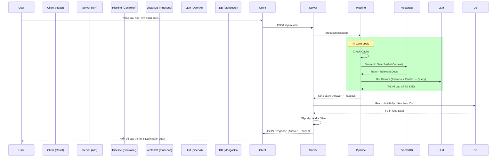

# 🤖 AI Agent Workflow (Luồng Hoạt Động Chi Tiết)

Tài liệu này mô tả chi tiết luồng dữ liệu (Data Flow) của tính năng tìm kiếm thông minh (AI Semantic Search) trong dự án **HanoiGo**, từ khi người dùng nhập liệu ở Client đến khi nhận được câu trả lời từ Server.

---

## 1. 🖥️ Client-Side Flow (Phía Người Dùng)

### Bước 1: Người dùng nhập liệu (`Input`)
*   **Vị trí**: Component `AISearchSection.jsx` (được nhúng trong trang `SearchResult.jsx`).
*   **Hành động**: Người dùng nhập câu hỏi (ví dụ: *"Quán cafe yên tĩnh để học bài"*) và nhấn Enter hoặc nút Search.
*   **Xử lý nội bộ**:
    1.  Hàm `handleSearch` được gọi.
    2.  Kích hoạt callback `onSearch` được truyền từ `SearchResult` page.

### Bước 2: Gọi API (`Service Layer`)
*   **Hook quản lý**: `useAIChat` (file `hooks/useAIChat.js`) sử dụng React Query (`useMutation`) để quản lý trạng thái loading/error.
*   **Service call**: `useAIChat` gọi hàm `sendChatMessage` trong `services/aiService.js`.
*   **Request**: Gửi HTTP POST request tới server.
    *   **URL**: `/api/ai/chat`
    *   **Body**: `{ question: "Quán cafe...", userId: "..." }`

---

## 2. 🌐 Server-Side Flow (API Layer)

### Bước 3: Tiếp nhận Request (`API Routes`)
*   **File**: `server/routes/aiRoutes.js`
*   **Xử lý**:
    1.  Endpoint `router.post('/chat')` nhận request.
    2.  Validate input (kiểm tra xem có `question` không).
    3.  Gọi hàm logic chính: `processMessage(question)` từ `services/ai/index.js`.

---

## 3. 🧠 AI Pipeline Execution (Luồng Xử Lý Thông Minh)

Đây là "bộ não" của hệ thống, được định nghĩa trong `server/services/ai/pipelines/mainChatPipeline.js`. Pipeline chạy tuần tự qua các bước sau:

### Bước 4: Input Guard & Caching
*   **Input Guard**: Kiểm tra câu hỏi có hợp lệ/an toàn không (độ dài, từ khóa cấm).
*   **Semantic Cache**:
    *   Kiểm tra trong bộ nhớ đệm (LRU Cache/Redis) xem câu hỏi này (hoặc câu tương tự) đã được trả lời chưa.
    *   ✅ **Hit**: Trả về kết quả ngay lập tức (Latency < 10ms).
    *   ❌ **Miss**: Tiếp tục sang Bước 5.

### Bước 5: Retrieval (Tìm Kiến Thức)
*   **Embedding**: Chuyển câu hỏi người dùng thành vector (dãy số) sử dụng model `text-embedding-3-large`.
*   **Vector Search**: Truy vấn database **Pinecone**.
    *   Tìm các đoạn văn bản (Documents) có vector *gần giống nhất* với vector câu hỏi.
    *   Lấy về Top K kết quả (ví dụ: 3-5 địa điểm phù hợp nhất).
*   **Reranking (Optional)**: Sắp xếp lại kết quả một lần nữa để đảm bảo độ chính xác cao nhất (hiện tại skip nều không cấu hình Cohere).

### Bước 6: Prompt Construction (Xây Dựng Ngữ Cảnh)
*   Hệ thống ghép nối các thông tin để tạo thành một "Prompt" gửi cho LLM:
    *   **System Persona**: "Bạn là Fong, hướng dẫn viên du lịch thân thiện, am hiểu Hà Nội..."
    *   **Context**: Thông tin các địa điểm tìm được ở Bước 5 (Tên, địa chỉ, đặc điểm...).
    *   **User Question**: Câu hỏi gốc của người dùng.

### Bước 7: LLM Inference (Suy Luận)
*   **Model**: Sử dụng **OpenAI GPT-4o-mini**.
*   **Nhiệm vụ**: LLM đọc context và sinh ra câu trả lời tự nhiên, trích xuất ID của các địa điểm được nhắc đến.
*   **Output**: Trả về câu trả lời dạng text (kèm emojis, format) và danh sách nguồn tham khảo.

---

## 4. 📦 Data Enrichment & Response (Làm Giàu Dữ Liệu)

Sau khi Pipeline trả về kết quả thô, `aiRoutes.js` tiếp tục xử lý:

### Bước 8: Fetch Full Data
*   Từ danh sách ID địa điểm mà AI gợi ý, Server truy vấn ngược lại **MongoDB** (`Place.find(...)`).
*   **Mục đích**: Lấy đầy đủ thông tin chi tiết nhất (Hình ảnh, Giá, Đánh giá, Giờ mở cửa...) mà Vector DB có thể không lưu hết.

### Bước 9: Reordering
*   Sắp xếp lại danh sách địa điểm từ MongoDB sao cho đúng thứ tự độ liên quan mà AI đã tìm ra (Tránh việc MongoDB trả về lộn xộn).

### Bước 10: Final Response
Server trả về JSON cho Client:
```json
{
  "success": true,
  "data": {
    "answer": "Chào bạn! Mình gợi ý quán X ở Cầu Giấy...",
    "places": [ ...chi tiết đầy đủ các quán... ],
    "sources": [ ...nguồn tham khảo... ]
  }
}
```

---

## 5. 🎨 Client Display (Hiển Thị Kết Quả)

### Bước 11: Render UI (`SearchResult.jsx`)
*   **AI Answer**: Hiển thị câu trả lời của Fong trong khung `AISearchSection`.
*   **Place List**: Render danh sách `PropertyCard` phía dưới.
*   **Detail Panel**: Khi người dùng click vào card, hiển thị thông tin chi tiết (lấy từ dữ liệu đã fetch ở Bước 8).

---

## 🔄 Tóm Tắt Luồng (Summary Diagram)


