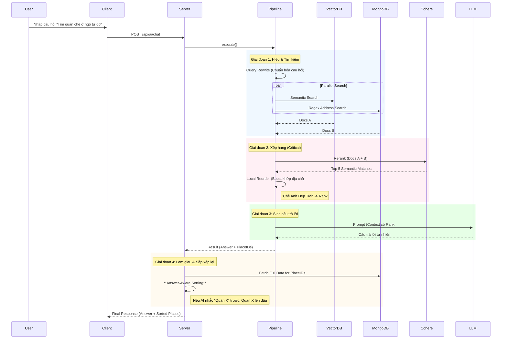

# 🤖 AI Agent Workflow (Luồng Hoạt Động Chi Tiết)

Tài liệu này mô tả chi tiết luồng dữ liệu (Data Flow) của tính năng tìm kiếm thông minh (AI Semantic Search) trong dự án **HanoiGo**, từ khi người dùng nhập liệu ở Client đến khi nhận được câu trả lời từ Server.

---

## 1. 🖥️ Client-Side Flow (Phía Người Dùng)

### Bước 1: Người dùng nhập liệu (`Input`)
*   **Vị trí**: Component `AISearchSection.jsx` (được nhúng trong trang `SearchResult.jsx`).
*   **Hành động**: Người dùng nhập câu hỏi (ví dụ: *"Quán cafe yên tĩnh để học bài"*) và nhấn Enter hoặc nút Search.
*   **Xử lý nội bộ**:
    1.  Hàm `handleSearch` được gọi.
    2.  Kích hoạt callback `onSearch` được truyền từ `SearchResult` page.

### Bước 2: Gọi API (`Service Layer`)
*   **Hook quản lý**: `useAIChat` (file `hooks/useAIChat.js`) sử dụng React Query (`useMutation`) để quản lý trạng thái loading/error.
*   **Service call**: `useAIChat` gọi hàm `sendChatMessage` trong `services/aiService.js`.
*   **Request**: Gửi HTTP POST request tới server.
    *   **URL**: `/api/ai/chat`
    *   **Body**: `{ question: "Quán cafe...", userId: "..." }`

---

## 2. 🌐 Server-Side Flow (API Layer)

### Bước 3: Tiếp nhận Request (`API Routes`)
*   **File**: `server/routes/aiRoutes.js`
*   **Xử lý**:
    1.  Endpoint `router.post('/chat')` nhận request.
    2.  Validate input (kiểm tra xem có `question` không).
    3.  Gọi hàm logic chính: `processMessage(question)` từ `services/ai/index.js`.

---

## 3. 🧠 AI Pipeline Execution (Luồng Xử lý Thông Minh)

Đây là "bộ não" của hệ thống, được định nghĩa trong `server/services/ai/pipelines/mainChatPipeline.js`. Pipeline chạy tuần tự theo logic **Hybrid Search + Re-ranking**:

### Bước 4: Input Guard & Caching
*   **Input Guard**: Kiểm tra câu hỏi có hợp lệ/an toàn không.
*   **Semantic Cache**: Kiểm tra xem câu hỏi tương tự đã có câu trả lời chưa (Redis). ✅ Hit -> Return ngay.

### Bước 5: Query Understanding (Hiểu Câu Hỏi)
*   **Query Rewrite**: Sử dụng LLM để viết lại câu hỏi, làm rõ ý định và chuẩn hóa địa danh (ví dụ: "chè bk" -> "quán chè khu vực Đại học Bách Khoa").

### Bước 6: Hybrid Retrieval (Tìm Kiếm Lai)
Hệ thống thực hiện song song 2 chiến lược tìm kiếm:
1.  **Vector Search (Pinecone)**: Tìm kiếm theo ngữ nghĩa (Semantic), hiểu được các mô tả trừu tượng (ví dụ: "quán lãng mạn").
2.  **Keyword/Regex Search (MongoDB)**:
    *   Tìm kiếm Text thông thường.
    *   **Smart Address Regex**: Tự động phát hiện các mẫu địa chỉ (Ngõ, Ngách, Phố) để tìm chính xác địa điểm theo vị trí địa lý (ví dụ: "Ngõ Tự Do").

### Bước 7: Optimize Ranking (Tối Ưu Thứ Hạng)
Kết quả từ Bước 6 được gộp lại và xử lý qua 2 tầng lọc:
1.  **Cohere Rerank**: Sử dụng model AI chuyên dụng (`rerank-multilingual-v3.0`) để sắp xếp lại danh sách dựa trên độ liên quan ngữ nghĩa sâu.
2.  **Local Reordering (Golden Fix)**:
    *   Tầng xử lý logic cuối cùng.
    *   Kiểm tra nếu có địa điểm khớp chính xác Tên hoặc Địa chỉ với câu hỏi gốc.
    *   **Boost** địa điểm đó lên vị trí đầu tiên (RANK #1).

### Bước 8: LLM Generation (Sinh Câu Trả Lời)
*   **Context Assembly**: Ghép các địa điểm đã sắp xếp vào prompt, đánh số thứ tự rõ ràng (`RANK #1`, `RANK #2`...).
*   **Instruction**: Yêu cầu LLM ưu tiên tuyệt đối thông tin từ `RANK #1` nếu có.
*   **Generation**: Sinh câu trả lời tự nhiên, trích xuất ID địa điểm.

---

## 4. 📦 Data Enrichment & Response

### Bước 9: Reordering Strategy (Chiến Thuật Sắp Xếp)
*   **Vấn đề**: Thứ tự địa điểm trả về từ MongoDB có thể không khớp với thứ tự mà AI đã "nghĩ" trong đầu.
*   **Giải pháp (Answer-Aware Sorting)**:
    1.  Server phân tích câu trả lời text của AI.
    2.  Sử dụng thuật toán **Fuzzy Matching** (tìm tên chính xác, tên ngắn, hoặc 3 từ đầu) để định vị quán trong văn bản.
    3.  Đảm bảo sự đồng nhất tuyệt đối giữa "Lời nói" (Text) và "Hành động" (UI Card).

### Bước 10: Final Response
Server trả về JSON cho Client, client chỉ việc render theo đúng thứ tự mảng `places`:
```json
{
  "success": true,
  "data": {
    "answer": "Theo mình, bạn nên thử quán [X] vì...",
    "places": [
       { "name": "X", ... }, // Luôn nằm đầu
       { "name": "Y", ... }
    ]
  }
}
```

---

## 5. 🎨 Client Display (Hiển Thị Kết Quả)

### Bước 11: Render UI (`SearchResult.jsx`)
*   **AI Answer**: Hiển thị câu trả lời của Fong.
*   **Place List**: Render danh sách card. Do Server đã sort sẵn, Client không cần xử lý logic phức tạp.

---

## 🔄 Tóm Tắt Luồng (Summary Diagram)

