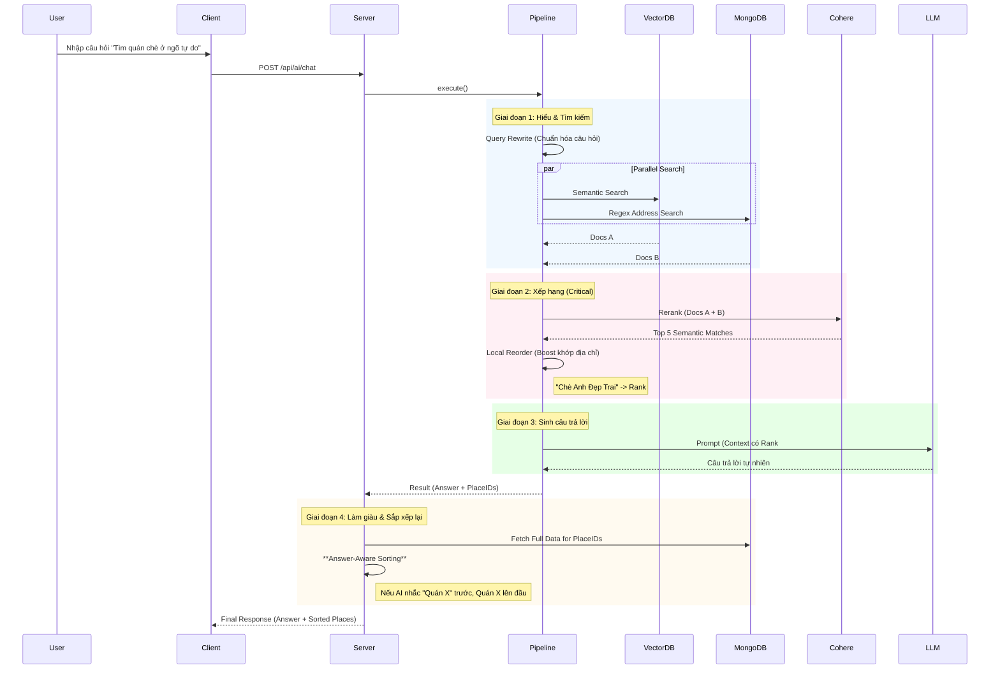

# 🤖 AI Agent Workflow (Luồng Hoạt Động Chi Tiết)

Tài liệu này mô tả chi tiết luồng dữ liệu (Data Flow) của tính năng tìm kiếm thông minh (AI Semantic Search) trong dự án **HanoiGo**, từ khi người dùng nhập liệu ở Client đến khi nhận được câu trả lời từ Server.

---

## 1. 🖥️ Client-Side Flow (Phía Người Dùng)

### Bước 1: Người dùng nhập liệu (`Input`)
*   **Vị trí**: Component `AISearchSection.jsx` (được nhúng trong trang `SearchResult.jsx`).
*   **Hành động**: Người dùng nhập câu hỏi (ví dụ: *"Quán cafe yên tĩnh để học bài"*) và nhấn Enter hoặc nút Search.
*   **Xử lý nội bộ**:
    1.  Hàm `handleSearch` được gọi.
    2.  Kích hoạt callback `onSearch` được truyền từ `SearchResult` page.

### Bước 2: Gọi API (`Service Layer`)
*   **Context Gathering**:
    *   Client thu thập tọa độ GPS (nếu User click "Near Me").
    *   Lấy thời gian hiện tại của thiết bị (`localTime`).
*   **Service call**: `useAIChat` gọi hàm `sendChatMessage`
*   **Request**: Gửi HTTP POST request tới server.
    *   **URL**: `/api/ai/chat`
    *   **Body**: `{ question: "...", context: { lat, lon, localTime } }`

---

## 2. 🌐 Server-Side Flow (API Layer)

### Bước 3: Tiếp nhận Request (`API Routes`)
*   **File**: `server/routes/aiRoutes.js`
*   **Xử lý**:
    1.  Endpoint `router.post('/chat')` nhận request.
    2.  Validate input (kiểm tra xem có `question` không).
    3.  Gọi hàm logic chính: `processMessage(question)` từ `services/ai/index.js`.

---

## 3. 🧠 AI Pipeline Execution (Luồng Xử lý Thông Minh)

Đây là "bộ não" của hệ thống, được định nghĩa trong `server/services/ai/pipelines/mainChatPipeline.js`. Pipeline chạy tuần tự theo logic **Hybrid Search + Re-ranking**:

### Bước 4: Pipeline Execution & Routing
*   **Router Pattern**:
    1.  **Input Guard**: Kiểm tra an toàn.
    2.  **Intent Classification**: LLM phân loại ý định User: `CHAT` hay `ITINERARY`.
    3.  **Context Injection**:
        *   Gọi Weather Service (Open-Meteo) lấy thời tiết hiện tại.
        *   Xác định khung giờ (Sáng/Trưa/Tối/Đêm).

### Bước 5: Branch 1 - General Chat (RAG)
Nếu Intent là `CHAT`:
1.  **Semantic Search**: Query Pinecone + MongoDB.
2.  **Re-ranking**:
    *   Cohere Rerank (Semantic).
    *   **Distance Sorting**: Nếu User cung cấp Location, ưu tiên địa điểm gần (Haversine Distance).
3.  **LLM Generation**: Prompt chứa thông tin thời tiết (ví dụ: "Cảnh báo mưa, ưu tiên quán trong nhà").

### Bước 6: Branch 2 - Itinerary Planning
Nếu Intent là `ITINERARY`:
1.  **Broad Retrieval**: Tìm kiếm đa dạng (Ăn uống + Cafe + Vui chơi).
2.  **Structured Generation**: LLM trả về JSON theo schema lịch trình (Sáng/Chiều/Tối).

---

## 4. 📦 Data Enrichment & Response

### Bước 9: Reordering Strategy (Chiến Thuật Sắp Xếp)
*   **Vấn đề**: Thứ tự địa điểm trả về từ MongoDB có thể không khớp với thứ tự mà AI đã "nghĩ" trong đầu.
*   **Giải pháp (Answer-Aware Sorting)**:
    1.  Server phân tích câu trả lời text của AI.
### Bước 9: Reordering & Formatting
Nếu là `CHAT`:
*   **Answer-Aware Sorting**: Sắp xếp lại danh sách `places` để khớp với thứ tự AI nhắc đến trong câu trả lời.

Nếu là `ITINERARY`:
*   **Structured Formatting**: Kiểm tra tính hợp lệ của JSON lịch trình.

### Bước 10: Final Response
Server trả về JSON cho Client:
```json
{
  "success": true,
  "data": {
    "intent": "CHAT" | "ITINERARY",
    "answer": "...", // Text trả lời hoặc JSON string
    "structuredData": { ... }, // Nếu là Itinerary
    "places": [...] // Danh sách địa điểm liên quan
  }
}
```

---

## 5. 🎨 Client Display (Hiển Thị Kết Quả)

### Bước 11: Render UI (`SearchResult.jsx`)
*   Kiểm tra `intent`:
    *   **CHAT**: Hiển thị Markdown Answer + List Card (`AISearchSection` + `PlaceList`).
    *   **ITINERARY**: Hiển thị `ItineraryTimeline` (Timeline Component) + List Card.

---

## 🔄 Tóm Tắt Luồng (Summary Diagram)

