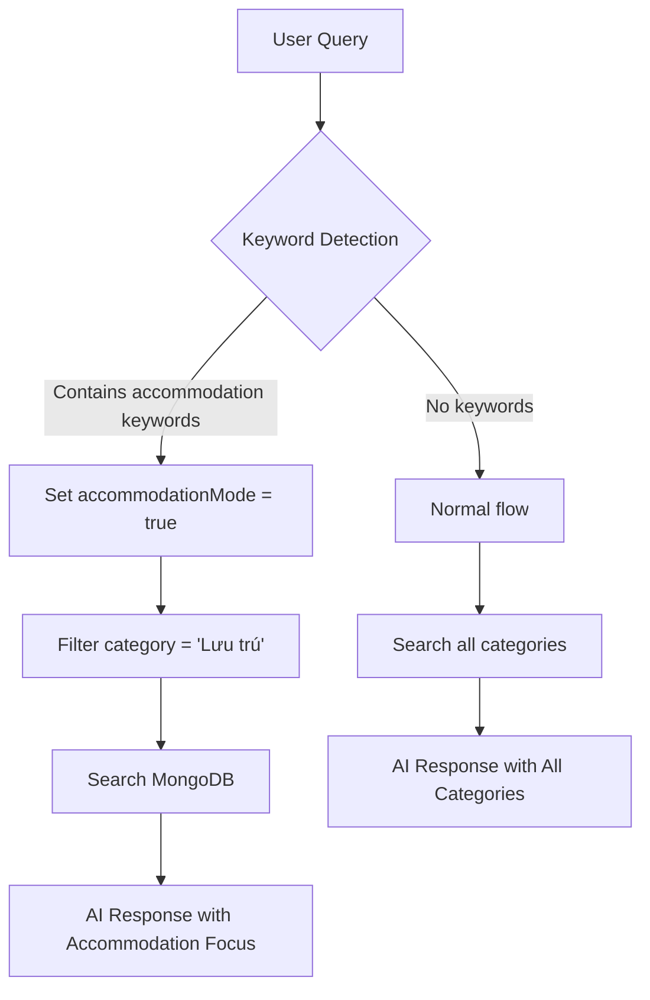

# 🏨 Accommodation Feature - Documentation

## Tổng Quan

Tính năng này cho phép AI nhận diện các truy vấn liên quan đến **nhu cầu lưu trú** (nhà nghỉ, homestay, khách sạn) và tự động ưu tiên gợi ý các địa điểm thuộc category "Lưu trú".

## 🎯 Use Cases

### Kịch bản 1: Hẹn hò về muộn
**Input:** *"Đi hẹn hò về muộn thì đi đâu?"*
**Output:** AI sẽ gợi ý các nhà nghỉ, homestay gần đó với thông tin:
- Giá cả hợp lý
- Vị trí tiện lợi
- Độ sạch sẽ, riêng tư
- Tone tư vấn: Tế nhị, không phán xét

### Kịch bản 2: Cần chỗ nghỉ qua đêm
**Input:** *"Tìm homestay giá rẻ khu Tây Hồ"*
**Output:** Danh sách homestay, nhà nghỉ ở Tây Hồ, filter theo giá

### Kịch bản 3: Context thời gian
**Input:** *"Bây giờ 23h rồi, cần chỗ ngủ gần Hoàn Kiếm"*
**Output:** Prioritize accommodation category, location-aware

## 🧠 AI Logic Flow



## 🔑 Trigger Keywords

AI sẽ kích hoạt accommodation mode khi detect các từ khóa:

### Tiếng Việt
- `về muộn`
- `về khuya`
- `hẹn hò về muộn`
- `hẹn hò tối muộn`
- `cần chỗ nghỉ`
- `ở lại qua đêm`
- `chỗ nghỉ qua đêm`
- `nhà nghỉ`
- `homestay`
- `khách sạn`
- `chỗ ngủ`
- `chỗ ở`
- `thuê phòng`
- `đặt phòng`

### English (Bonus)
- `hotel`
- `accommodation`
- `stay overnight`

## 📊 Database Schema

### Place Model - Category Enum
```javascript
category: {
  type: String,
  enum: ['Ăn uống', 'Vui chơi', 'Mua sắm', 'Dịch vụ', 'Lưu trú', 'Khác']
}
```

### AI Tags - Suitability
Các địa điểm "Lưu trú" nên có tag:
- `suitability: ['hẹn hò', 'thư giãn', 'một mình']`
- `mood: ['chill', 'lãng mạn', 'yên bình']`
- `specialFeatures: ['wifi miễn phí', 'điều hòa', 'view đẹp']`

## 🛠️ Implementation Details

### 1. Model Update
**File:** `server/models/Place.js`
```javascript
// Thêm 'Lưu trú' vào enum
category: {
  enum: ['Ăn uống', 'Vui chơi', 'Mua sắm', 'Dịch vụ', 'Lưu trú', 'Khác']
}
```

### 2. AI Prompt Update
**File:** `server/services/ai/prompts/templates/system.v1.txt`
```
🏨 NHẬN DIỆN CONTEXT ĐẶC BIỆT - LƯU TRÚ:
Khi phát hiện người dùng:
- Hỏi về "về muộn", "về khuya", "hẹn hò tối", "cần chỗ nghỉ", "ở lại qua đêm"
→ ƯU TIÊN gợi ý CATEGORY: "Lưu trú"
→ Tập trung: Giá cả, vị trí, độ sạch, riêng tư
```

**File:** `server/services/ai/prompts/templates/rag_query.v1.txt`
```
🏨 XỬ LÝ ĐẶC BIỆT - YÊU CẦU LƯU TRÚ:
Nếu câu hỏi liên quan đến lưu trú:
1. Chỉ liệt kê địa điểm có CATEGORY = "Lưu trú"
2. Tập trung: Giá, vị trí, sạch sẽ, riêng tư
3. Tone: Tế nhị, tư vấn chân thành
```

### 3. Pipeline Update
**File:** `server/services/ai/pipelines/mainChatPipeline.js`

**Stage: Keyword Augmentation**
```javascript
// Detect accommodation keywords
const accommodationKeywords = [
  'về muộn', 'về khuya', 'hẹn hò về muộn',
  'cần chỗ nghỉ', 'ở lại qua đêm', 'nhà nghỉ',
  'homestay', 'khách sạn', 'chỗ ngủ', ...
];

const needsAccommodation = accommodationKeywords.some(kw => query.includes(kw));

if (needsAccommodation) {
  input.accommodationMode = true; // Flag for filtering
}
```

**Stage: Hybrid Search**
```javascript
// Apply category filter
const categoryFilter = input.accommodationMode ? 'Lưu trú' : null;

// Pass filter to search functions
promises.push(searchPlaces(query, textLimit, categoryFilter));
promises.push(searchPlacesByRegex(regex, 5, categoryFilter));
```

### 4. Service Layer Update
**File:** `server/services/placeService.js`

**searchPlaces() - Thêm category parameter**
```javascript
export const searchPlaces = async (searchText, limit = 20, category = null) => {
  const query = { $text: { $search: searchText } };
  
  if (category) {
    query.category = category; // Filter by category
  }
  
  return await Place.find(query)
    .sort({ score: { $meta: 'textScore' } })
    .limit(limit)
    .lean();
};
```

**searchPlacesByRegex() - Thêm category parameter**
```javascript
export const searchPlacesByRegex = async (regex, limit = 5, category = null) => {
  const query = { address: regex };
  
  if (category) {
    query.category = category;
  }
  
  return await Place.find(query).limit(limit).lean();
};
```

## 🚀 Usage Guide

### For Developers

**1. Chạy script tag accommodation places:**
```bash
# Review mode (không update DB)
node server/scripts/tagAccommodations.js

# Execute mode (update DB)
node server/scripts/tagAccommodations.js --execute
```

Script này sẽ tự động detect và tag các địa điểm có tên/mô tả chứa keywords accommodation thành category "Lưu trú".

**2. Thêm địa điểm mới (Manual):**
```javascript
// Via Admin Dashboard
{
  name: "Nhà nghỉ Anh Đẹp Trai",
  category: "Lưu trú", // ✅ Important
  description: "Nhà nghỉ sạch sẽ, giá rẻ, view đẹp",
  priceRange: { min: 150000, max: 300000 },
  aiTags: {
    suitability: ['hẹn hò', 'thư giãn'],
    mood: ['lãng mạn', 'yên bình'],
    specialFeatures: ['wifi miễn phí', 'điều hòa']
  }
}
```

**3. Test AI behavior:**
```bash
# Via Postman/Client
POST /api/chat
{
  "question": "Đi hẹn hò về muộn nên đi đâu?",
  "context": {
    "location": { "lat": 21.0285, "lon": 105.8542 }
  }
}

# Expected: AI trả về danh sách nhà nghỉ/homestay
```

### For Admin

**Thêm địa điểm Lưu trú qua Admin Dashboard:**
1. Login vào Admin Panel
2. Vào "Places" → "Add New Place"
3. **Quan trọng:** Chọn Category = "Lưu trú"
4. Điền thông tin:
   - Name: Tên nhà nghỉ/homestay
   - Address: Địa chỉ cụ thể
   - Price Range: Giá phòng (min-max)
   - AI Tags:
     - Suitability: hẹn hò, thư giãn
     - Mood: lãng mạn, yên bình
     - Special Features: wifi, điều hòa, view đẹp
5. Save → AI sẽ tự động gợi ý địa điểm này khi user hỏi về lưu trú

## 📈 Performance Considerations

### Caching
- AI responses được cache với key = `query + accommodationMode`
- Cache TTL: 1 giờ
- Invalidate cache khi có place mới thuộc category "Lưu trú"

### Indexing
```javascript
// MongoDB indexes để optimize search
Place.createIndex({ category: 1 });
Place.createIndex({ category: 1, 'location.coordinates': '2dsphere' });
Place.createIndex({ 
  name: 'text', 
  description: 'text', 
  address: 'text' 
});
```

### Query Optimization
- Limit results: 10 (normal) / 20 (itinerary)
- Use `.lean()` để giảm memory overhead
- Parallel search: Vector + Keyword

## 🧪 Testing Checklist

- [ ] Query "về muộn" → Trả về category "Lưu trú"
- [ ] Query "nhà nghỉ Ba Đình" → Filter by district + category
- [ ] Query "homestay giá rẻ" → Sort by price ascending
- [ ] Query "hẹn hò tối muộn" → accommodationMode = true
- [ ] Query "quán ăn ngon" → accommodationMode = false (normal flow)
- [ ] Time context: 23h → Suggest accommodation if query ambiguous
- [ ] Location context: Gợi ý accommodation gần nhất

## 🐛 Troubleshooting

### Vấn đề 1: AI không nhận diện accommodation
**Nguyên nhân:** Từ khóa không match
**Giải pháp:** Thêm keyword vào `accommodationKeywords` array

### Vấn đề 2: Kết quả trả về rỗng
**Nguyên nhân:** Chưa có place nào category="Lưu trú"
**Giải pháp:** Chạy script `tagAccommodations.js --execute`

### Vấn đề 3: AI vẫn gợi ý quán ăn
**Nguyên nhân:** Category filter không được apply
**Giải pháp:** Check logs `accommodationMode: true` có xuất hiện không

## 📝 Future Enhancements

- [ ] **Price filter:** Auto-filter theo budget user
- [ ] **Rating filter:** Chỉ show places có rating > 4 sao
- [ ] **Booking integration:** Link đặt phòng trực tiếp
- [ ] **Real-time availability:** Tích hợp API booking để check phòng trống
- [ ] **Multi-language:** Support English queries

## 📚 Related Files

- `server/models/Place.js` - Schema definition
- `server/services/placeService.js` - Search logic
- `server/services/ai/pipelines/mainChatPipeline.js` - AI pipeline
- `server/services/ai/prompts/templates/system.v1.txt` - System prompt
- `server/services/ai/prompts/templates/rag_query.v1.txt` - RAG prompt
- `server/scripts/tagAccommodations.js` - Tagging script

---

**Tác giả:** HaNoiGo AI Team  
**Ngày tạo:** 15/01/2026  
**Version:** 1.0.0
